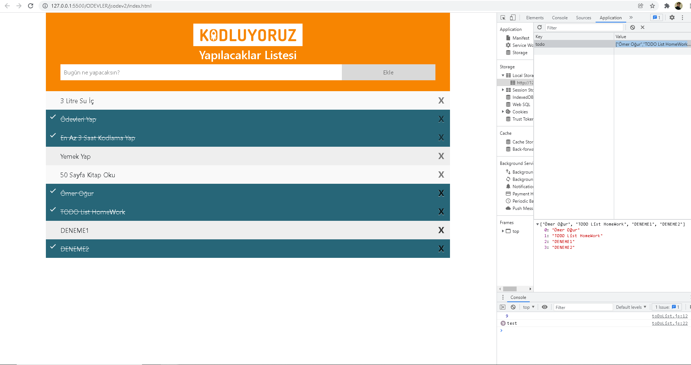

#Ömer Oğur 
Listeye boş karakter eklenemiyor. Bununla birlikte hiçbir şey yazılmadığında da aynı hatayı veriyor.

Element eklemeyi sağlayan bir fonksiyon, element silmeyi sağlayan bir fonksiyon, yapıldı işaretlenmesini sağlayan bir fonksiyon eklendi

Element eklendiğinde ve hata verirken sağ üstte uyarı  Toast bildirimdi kullanıldı 

Girilen inputları  LocalStorage  kaydetme ve silme fonksiyonları yazıldı.

Sayfa Yenilendiğinde LocalStorage da olan verileri sayfaya yükleyen fonksiyon yazıldı.

